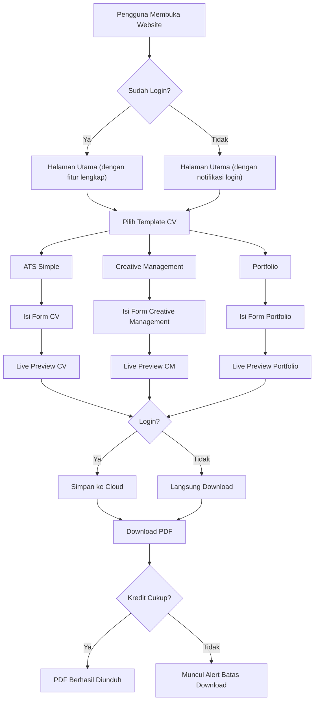
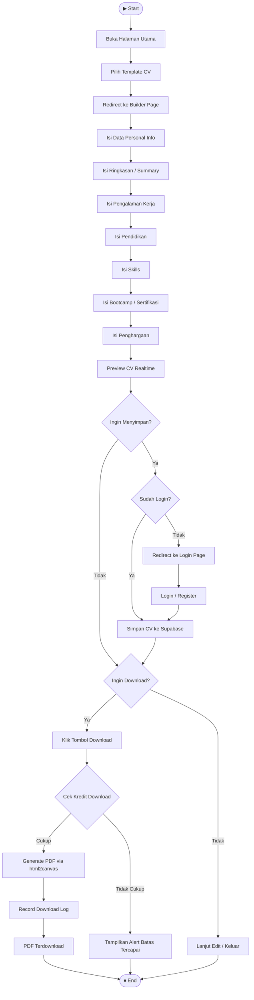
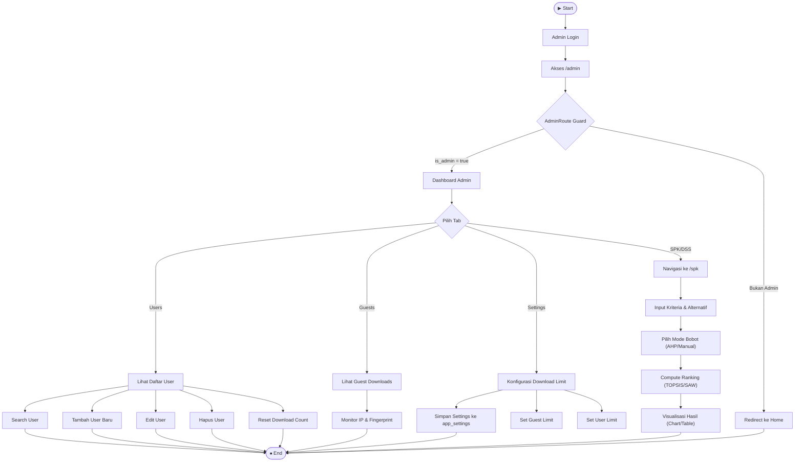
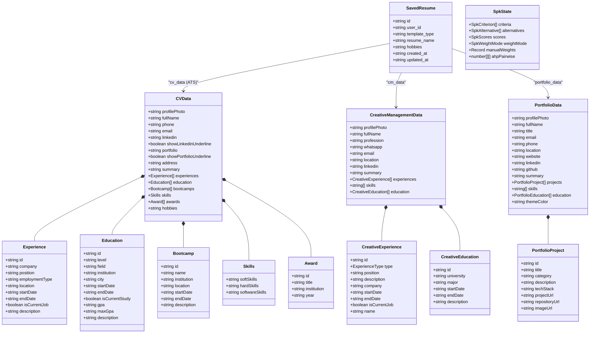
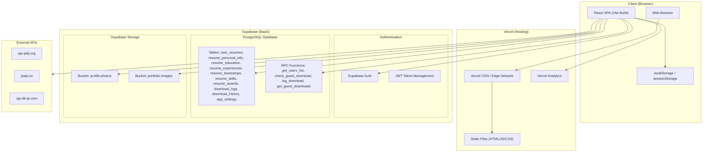
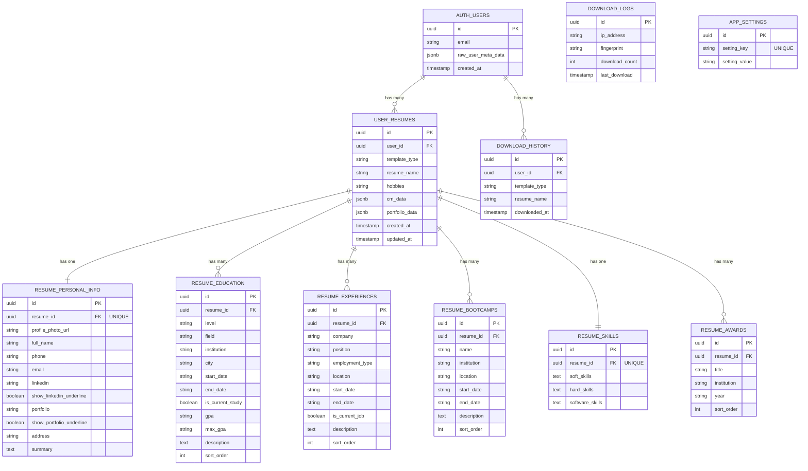

# FreeBuild CV — Dokumentasi Sistem

## 1. Penjelasan Umum Aplikasi

**FreeBuild CV** adalah aplikasi web builder CV (Curriculum Vitae) ATS-Friendly yang dibangun menggunakan **React + Vite + TypeScript** dengan backend **Supabase** (PostgreSQL + Auth + Storage). Aplikasi ini memungkinkan pengguna membuat, mengedit, menyimpan, dan mengunduh CV profesional dalam format PDF secara **gratis**.

### Fitur Utama

| Fitur | Deskripsi |
|---|---|
| **CV Builder (ATS Simple)** | Pembuatan CV sederhana yang dioptimalkan untuk ATS |
| **Creative Management Builder** | Template CV kreatif untuk posisi manajemen |
| **Portfolio Builder** | Pembuatan portfolio web interaktif |
| **Multi-Template** | 3+ template CV dengan desain berbeda |
| **Download PDF** | Ekspor CV ke PDF langsung dari browser |
| **Cloud Save** | Simpan dan edit ulang CV dari perangkat manapun (user login) |
| **Download Credit System** | Pembatasan download (Guest: 3, User: 6, konfigurabel admin) |
| **Admin Dashboard** | Manajemen user, konfigurasi sistem, dan monitoring |
| **SPK/DSS Module** | Analitik keputusan menggunakan metode AHP + TOPSIS/SAW (admin only) |
| **Donasi QRIS** | Sistem donasi terintegrasi via QRIS |

### Flow Pengguna (User Journey)

---

## 2. Use Case Diagram

```mermaid
flowchart TB
    subgraph System ["FreeBuild CV System"]
        UC1["Melihat Landing Page"]
        UC2["Mendaftar Akun"]
        UC3["Login"]
        UC4["Memilih Template CV"]
        UC5["Mengisi Data CV"]
        UC6["Preview CV Realtime"]
        UC7["Download CV PDF"]
        UC8["Menyimpan CV ke Cloud"]
        UC9["Melihat Daftar Resume Tersimpan"]
        UC10["Mengedit Resume Tersimpan"]
        UC11["Menghapus Resume"]
        UC12["Melihat Riwayat Download"]
        UC13["Mengubah Pengaturan Akun"]
        UC14["Donasi via QRIS"]
        UC15["Melihat Changelog"]

        UC20["Mengelola Daftar User"]
        UC21["Menambah User Baru"]
        UC22["Mengedit User"]
        UC23["Menghapus User"]
        UC24["Melihat Guest Downloads"]
        UC25["Mengkonfigurasi Download Limit"]
        UC26["Reset Download Count User"]
        UC27["Mengakses SPK/DSS Analytics"]
    end

    Guest(["👤 Guest"])
    User(["👤 User (Login)"])
    Admin(["👤 Admin"])

    Guest --> UC1
    Guest --> UC2
    Guest --> UC3
    Guest --> UC4
    Guest --> UC5
    Guest --> UC6
    Guest --> UC7
    Guest --> UC14
    Guest --> UC15

    User --> UC1
    User --> UC4
    User --> UC5
    User --> UC6
    User --> UC7
    User --> UC8
    User --> UC9
    User --> UC10
    User --> UC11
    User --> UC12
    User --> UC13
    User --> UC14

    Admin --> UC20
    Admin --> UC21
    Admin --> UC22
    Admin --> UC23
    Admin --> UC24
    Admin --> UC25
    Admin --> UC26
    Admin --> UC27
```

### Deskripsi Aktor

| Aktor | Deskripsi |
|---|---|
| **Guest** | Pengunjung yang belum memiliki akun atau belum login. Bisa membuat CV dan download dengan limit 3x/hari. |
| **User** | Pengguna yang telah mendaftar dan login. Mendapat limit download 6x/hari dan fitur cloud save. |
| **Admin** | Administrator sistem yang memiliki `is_admin = true` di user metadata. Akses penuh ke dashboard manajemen. |

---

## 3. Activity Diagram

### 3.1 Activity Diagram — Pembuatan & Download CV

### 3.2 Activity Diagram — Admin Dashboard

---

## 4. Development / Class Diagram

Diagram ini menunjukkan hubungan antara type/interface utama dalam aplikasi.

---

## 5. Component Diagram

```mermaid
flowchart TB
    subgraph App ["App.tsx (Root)"]
        AuthProvider["AuthProvider"]
        Router["BrowserRouter"]
        Navbar["Navbar"]
    end

    subgraph Pages ["Pages"]
        MainPage["MainPage"]
        LoginPage["LoginPage"]
        RegisterPage["RegisterPage"]
        EmailConfirmed["EmailConfirmedPage"]
        CVBuilder["CVBuilderPage"]
        CMBuilder["CreativeManagementBuilderPage"]
        PortfolioBuilder["PortfolioBuilderPage"]
        MyResumes["MyResumesPage"]
        DownloadHistory["DownloadHistoryPage"]
        Settings["SettingsPage"]
        AdminDashboard["AdminDashboardPage"]
        SpkDss["SpkDssPage"]
        Donate["DonatePage"]
        Changelog["ChangelogPage"]
        Terms["TermsPage"]
        Privacy["PrivacyPage"]
    end

    subgraph Guards ["Route Guards"]
        ProtectedRoute["ProtectedRoute"]
        AdminRoute["AdminRoute"]
    end

    subgraph CVComponents ["CV Builder Components"]
        CVForm["CVForm (index)"]
        PersonalInfoForm["PersonalInfoForm"]
        SummaryForm["SummaryForm"]
        ExperienceForm["ExperienceForm"]
        EducationForm["EducationForm"]
        SkillsForm["SkillsForm"]
        BootcampForm["BootcampForm"]
        AwardForm["AwardForm"]
        HobbyForm["HobbyForm"]
        CVPreview["CVPreview (index)"]
        PreviewHeader["PreviewHeader"]
        PreviewExperience["PreviewExperience"]
        PreviewEducation["PreviewEducation"]
        PreviewSkills["PreviewSkills"]
        PreviewBootcamp["PreviewBootcamp"]
        PreviewAwards["PreviewAwards"]
        PreviewHobby["PreviewHobby"]
    end

    subgraph CMComponents ["Creative Management Components"]
        CMForm["CreativeManagementForm"]
        CMPreview["CreativeManagementPreview"]
        CMPDF["CreativeManagementPDF"]
    end

    subgraph PortfolioComponents ["Portfolio Components"]
        PForm["PortfolioForm"]
        PPreview["PortfolioPreview"]
        PPDF["PortfolioPDF"]
    end

    subgraph SPKComponents ["SPK/DSS Components"]
        CriteriaEditor["CriteriaEditor"]
        AlternativesMatrix["AlternativesMatrix"]
        WeightsAHP["WeightsAHP"]
        WeightsManual["WeightsManual"]
        ResultsView["ResultsView"]
        SpkBarChart["SpkBarChart"]
        SpkPieChart["SpkPieChart"]
        SpkRadarChart["SpkRadarChart"]
        SpkRankingTable["SpkRankingTable"]
    end

    subgraph UIComponents ["Shared UI Components"]
        TextType["TextType"]
        DecryptedText["DecryptedText"]
        RichTextEditor["RichTextEditor"]
        SplashScreen["SplashScreen"]
    end

    subgraph Services ["Service Layer"]
        ResumeService["resumeService.ts"]
        DownloadCredit["downloadCredit.ts"]
        RateLimiter["rateLimiter.ts"]
        SupabaseClient["supabase.ts"]
        SPKLib["spk/ (ahp, topsis, saw)"]
    end

    App --> Pages
    App --> Guards

    ProtectedRoute --> MyResumes
    ProtectedRoute --> DownloadHistory
    ProtectedRoute --> Settings
    AdminRoute --> AdminDashboard
    AdminRoute --> SpkDss

    CVBuilder --> CVForm
    CVBuilder --> CVPreview
    CVForm --> PersonalInfoForm
    CVForm --> SummaryForm
    CVForm --> ExperienceForm
    CVForm --> EducationForm
    CVForm --> SkillsForm
    CVForm --> BootcampForm
    CVForm --> AwardForm
    CVForm --> HobbyForm

    CVPreview --> PreviewHeader
    CVPreview --> PreviewExperience
    CVPreview --> PreviewEducation
    CVPreview --> PreviewSkills
    CVPreview --> PreviewBootcamp
    CVPreview --> PreviewAwards
    CVPreview --> PreviewHobby

    CMBuilder --> CMForm
    CMBuilder --> CMPreview
    CMBuilder --> CMPDF

    PortfolioBuilder --> PForm
    PortfolioBuilder --> PPreview
    PortfolioBuilder --> PPDF

    SpkDss --> CriteriaEditor
    SpkDss --> AlternativesMatrix
    SpkDss --> WeightsAHP
    SpkDss --> WeightsManual
    SpkDss --> ResultsView
    ResultsView --> SpkBarChart
    ResultsView --> SpkPieChart
    ResultsView --> SpkRadarChart
    ResultsView --> SpkRankingTable

    Pages --> Services
    Services --> SupabaseClient
    SpkDss --> SPKLib
```

---

## 6. Deployment Diagram

### Teknologi yang Digunakan

| Layer | Teknologi |
|---|---|
| **Frontend Framework** | React 18 + TypeScript |
| **Build Tool** | Vite 7 |
| **Styling** | Tailwind CSS |
| **State Management** | React Context (AuthContext) + useState |
| **Routing** | React Router DOM v6 |
| **PDF Generation** | html2canvas + jsPDF |
| **Animations** | Lottie (lottie-react), Animate.css |
| **UI Alerts** | SweetAlert2 |
| **Rich Text** | Custom RichTextEditor component |
| **Backend (BaaS)** | Supabase (PostgreSQL + Auth + Storage + RPC) |
| **Hosting** | Vercel |
| **Analytics** | Vercel Analytics |
| **IP Detection** | ipify, ipapi.co, db-ip.com (fallback chain) |

---

## 7. Entity Relationship Diagram (ERD)

### Penjelasan Tabel

| Tabel | Deskripsi |
|---|---|
| `auth.users` | Tabel bawaan Supabase Auth. Menyimpan data otentikasi dan metadata user (username, is_admin, download_count). |
| `user_resumes` | Tabel induk untuk semua resume yang disimpan user. Field `template_type` menentukan jenis template (ats_simple, creative_management, portfolio). Data CM dan Portfolio disimpan sebagai JSONB. |
| `resume_personal_info` | Data info personal CV (1:1 dengan resume). |
| `resume_education` | Data pendidikan CV (1:N, diurutkan `sort_order`). |
| `resume_experiences` | Data pengalaman kerja CV (1:N, diurutkan `sort_order`). |
| `resume_bootcamps` | Data bootcamp/sertifikasi CV (1:N, diurutkan `sort_order`). |
| `resume_skills` | Data keahlian CV (1:1 dengan resume). |
| `resume_awards` | Data penghargaan CV (1:N, diurutkan `sort_order`). |
| `download_logs` | Tracking download untuk guest berdasarkan IP + fingerprint. |
| `download_history` | Riwayat download untuk user yang login. |
| `app_settings` | Konfigurasi sistem key-value (guest_download_limit, user_download_limit). |

### Supabase Storage Buckets

| Bucket | Deskripsi |
|---|---|
| `profile-photos` | Foto profil CV user. Path: `{user_id}/{resume_id}.{ext}` |
| `portfolio-images` | Gambar portfolio (foto profil + gambar proyek). Path: `{user_id}/{resume_id}/{key}.{ext}` |

### RPC Functions (Server-Side)

| Function | Deskripsi |
|---|---|
| `get_users_list()` | Mengembalikan daftar seluruh user (admin only). |
| `check_guest_download(p_ip, p_fingerprint, p_max)` | Mengecek apakah guest masih boleh download, dan merekam jika diizinkan. |
| `log_download(p_template_type, p_resume_name)` | Mencatat riwayat download untuk user yang login. |
| `get_guest_downloads()` | Mengembalikan aggregasi download per IP (admin monitoring). |

---

## Ringkasan Arsitektur

FreeBuild CV menggunakan arsitektur **SPA (Single Page Application)** yang di-deploy sebagai **static files** di Vercel, dengan seluruh backend logic ditangani oleh **Supabase** sebagai Backend-as-a-Service. Tidak ada server custom — semua operasi database dilakukan melalui Supabase client SDK dan RPC functions.

Keamanan diterapkan melalui:
- **Row Level Security (RLS)** di Supabase
- **Route Guards** di frontend (`ProtectedRoute`, `AdminRoute`)
- **Client-side Rate Limiting** untuk login/register
- **Device Fingerprinting + IP** untuk tracking guest downloads
- **Input Sanitization** untuk mencegah XSS
